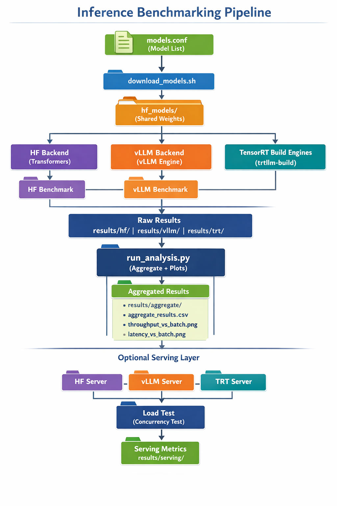

# 🚀 LLM Inference Systems Study

**KV Cache Dynamics · Compute vs Bandwidth Regimes · Backend Engineering**

A GPU-native investigation of decoder-only LLM inference performance across HuggingFace, vLLM, and TensorRT-LLM, with explicit KV cache modeling and backend-aware benchmarking.

This project studies how architectural parameters, GPU memory systems, and backend implementations determine real-world decode performance on 48GB-class GPUs.

This is **inference systems engineering**, not model fine-tuning.

---

# 🎯 Objective

Understand when LLM inference is:

* **Compute-bound**
* **Memory-bandwidth-bound**
* **Memory-capacity-constrained**
* **Backend-limited**

Rather than just measuring tokens/sec, this project models and validates the structural causes of performance behavior.

---

# 🏗 Experimental Environment

## Hardware

* 48GB VRAM GPU (RTX 6000 Ada / A6000 class)
* CUDA 12.x
* Single GPU
* bfloat16 precision

48GB VRAM enables:

* 8K–16K context analysis
* Large batch scaling without early OOM
* Clear separation between bandwidth vs capacity limits

---

# 🧠 Models Evaluated

* Qwen2.5-0.5B-Instruct
* Qwen2.5-1.5B
* Qwen2.5-7B
* Llama-3.1-8B

All experiments use bfloat16 unless otherwise specified.

---

# ⚙️ Backends Compared

| Backend      | KV Strategy | Execution Model      |
| ------------ | ----------- | -------------------- |
| HuggingFace  | Dynamic KV  | PyTorch eager        |
| vLLM         | Paged KV    | Custom CUDA kernels  |
| TensorRT-LLM | Paged KV    | Engine-compiled CUDA |

This comparison isolates:

* Kernel fusion impact
* KV memory layout strategy
* Scheduling differences
* Engine compilation advantages

---

# 🧮 KV Cache Model

For decoder-only transformers:

```
KV_MB_per_token =
(2 × L × hidden_size × bytes) / 1024²
```

Where:

* L = number of layers
* hidden_size = model width
* bytes = dtype size (bf16 = 2)

Total KV memory:

```
KV_total_MB =
batch × tokens × KV_MB_per_token
```

Example (7B model):

≈ 0.38 MB per token (batch = 1)

KV memory scales linearly with:

* Batch size
* Generated tokens
* Model depth
* Hidden dimension

This model allows prediction of memory regime transitions.

---

# 📊 Empirical Results (Measured)

All results below were collected on a 48GB GPU.

---

## 1️⃣ Sequence Length Scaling

**Model: Llama-3.1-8B**
Batch = 1
Decode tokens = 128
bf16 precision

| Context | Prefill (s) | Decode (s) | Per-token (ms) | Throughput (tok/s) | GPU Mem (MB) |
| ------- | ----------- | ---------- | -------------- | ------------------ | ------------ |
| 512     | 0.28        | 3.06       | 23.94          | 41.77              | 15543        |
| 4096    | 0.59        | 3.24       | 25.31          | 39.50              | 16871        |

### Observations

* KV memory increased ~1.3GB.
* Per-token decode latency increased moderately.
* Throughput degradation was mild.
* Decode did not collapse under longer context.

### Interpretation

At 48GB memory headroom:

* Decode remains largely compute-efficient.
* KV growth measurable but bandwidth not saturated.
* Arithmetic intensity remains sufficient.

---

## 2️⃣ Batch Scaling

**Model: Llama-3.1-8B**
Decode tokens = 128
bf16 precision

| Batch | Decode (s) | Per-token (ms) | Throughput (tok/s) | GPU Mem (MB) |
| ----- | ---------- | -------------- | ------------------ | ------------ |
| 1     | 3.24       | 25.30          | 39.52              | 16871        |
| 2     | 3.59       | 28.03          | 71.36              | 18417        |
| 4     | 4.01       | 31.33          | 127.73             | 21510        |
| 8     | 5.38       | 42.03          | 190.33             | 27696        |
| 16    | OOM        | —              | —                  | >40GB        |

### Observations

* Throughput scales strongly up to batch 8.
* Latency increases with batch.
* Memory scales linearly.
* OOM at batch 16.

### Interpretation

* Batch 1–4: compute-efficient regime.
* Batch 8: bandwidth pressure begins.
* Batch 16: memory capacity limit.

---

## 3️⃣ Precision Scaling

**Model: Llama-3.1-8B**
Batch = 1

| Dtype | Decode (s) | Per-token (ms) | Throughput (tok/s) | GPU Mem (MB) |
| ----- | ---------- | -------------- | ------------------ | ------------ |
| FP16  | 3.24       | 25.29          | 39.54              | 16871        |
| FP32  | 8.31       | 64.94          | 15.40              | 36794        |

### Interpretation

FP16 enables:

* Tensor Core acceleration
* Reduced memory footprint
* Higher effective bandwidth

FP32:

* Doubles memory
* Reduces compute throughput
* Pushes decode toward bandwidth stress

---

## 4️⃣ Serving Load Test (20 Concurrent Users)

* Average latency: 3.92 sec
* P50 latency: 3.34 sec
* P95 latency: 4.97 sec
* Max latency: 5.14 sec

Dynamic batching introduces:

* Improved GPU utilization
* Increased tail latency
* Latency variance due to scheduling

This demonstrates real-world SLO tradeoffs.

---

# 🧠 Regime Summary

| Scaling Dimension | First Bottleneck    |
| ----------------- | ------------------- |
| Batch ↑           | Memory bandwidth    |
| Sequence ↑        | KV growth           |
| Model size ↑      | Memory capacity     |
| Precision ↑       | Compute + bandwidth |
| Traffic ↑         | GPU saturation      |

---

# 🏗 Repository Structure

```
LLM_Engineering/
├── bootstrap_host.sh
├── benchmarks/
│   ├── hf/
│   ├── vllm/
│   ├── trt/
├── serving/
├── results/
├── hf_models/
├── trt_ckpt/
├── trt_engine/
└── README.md
```

---

# 🚀 Environment Setup

## 1️⃣ System Requirements

* Linux (Ubuntu 22.04 recommended)
* NVIDIA driver ≥ 535
* CUDA 12.x
* Python 3.10+
* 48GB GPU recommended

---

## 2️⃣ Install NVIDIA & Docker

```bash
chmod +x bootstrap_host.sh
./bootstrap_host.sh
```

Installs:

* NVIDIA driver
* Docker
* NVIDIA Container Toolkit
* CUDA validation

---

## 3️⃣ HuggingFace Environment

```bash
python3 -m venv .venv_hf
source .venv_hf/bin/activate

pip install --upgrade pip
pip install torch --index-url https://download.pytorch.org/whl/cu121
pip install transformers huggingface_hub accelerate
```

Run benchmark:

```bash
python benchmarks/hf/bm_hf.py \
  --model hf_models/llama3_1_8b \
  --batch_size 1,2,4,8 \
  --max_new_tokens 128
```

---

## 4️⃣ vLLM Environment

```bash
python3 -m venv .venv_vllm
source .venv_vllm/bin/activate

pip install vllm transformers
```

Run:

```bash
python benchmarks/vllm/bm_vllm.py \
  --model hf_models/llama3_1_8b \
  --batch_size 1,2,4,8,16 \
  --max_new_tokens 128 \
  --dtype bfloat16 \
  --max_model_len 8192 \
  --gpu_memory_utilization 0.95
```

---

## 5️⃣ TensorRT-LLM Setup

Pull container:

```bash
docker login nvcr.io
docker pull nvcr.io/nvidia/tensorrt-llm/release:1.3.0rc3
```

Run:

```bash
docker run --gpus all -it \
  -v $PWD:/workspace \
  nvcr.io/nvidia/tensorrt-llm/release:1.3.0rc3
```

Convert checkpoint:

```bash
python convert_checkpoint.py \
  --model_dir hf_models/llama3_1_8b \
  --output_dir trt_ckpt/llama3_1_8b \
  --dtype bfloat16
```

Build engine:

```bash
trtllm-build \
  --checkpoint_dir trt_ckpt/llama3_1_8b \
  --output_dir trt_engine/llama3_1_8b \
  --max_batch_size 32 \
  --max_seq_len 8192
```

---

# 📂 Results Directory

All benchmark outputs stored in:

```
results/
```

Includes:

* Throughput scaling
* KV growth validation
* Precision comparison
* Backend comparison

---

# 🏁 Engineering Contributions

This project demonstrates:

* KV cache analytical modeling
* Compute vs bandwidth regime diagnosis
* Multi-backend benchmarking
* Engine-level TensorRT workflow
* GPU-native deployment
* Reproducible inference measurement

---

# 🔭 Future Work

* Multi-GPU tensor parallel study
* INT8 / FP8 quantization comparison
* Roofline intensity modeling
* Communication-bound regime analysis
* Triton production deployment


#
*```allocate a contanier of big size

docker run -it --gpus all --shm-size=32g \
  --name trt_llm_big \
  -v /ephemeral/llm_workspace:/workspace \
  -v /ephemeral/hf_models:/workspace/hf_models \
  -v /ephemeral/trt_engine:/workspace/trt_engine \
  nvcr.io/nvidia/tensorrt-llm/release:1.3.0rc3 \
  bash


```


Here is your workflow formatted cleanly as a **README.md section** you can paste directly into your repo.

---

````markdown
# Inference Benchmarking Workflow

This document describes the complete end-to-end workflow for running inference benchmarks and analysis using HuggingFace, vLLM, and TensorRT-LLM backends.

---

# Overview

The pipeline includes:

- Model download
- Backend environment setup
- TensorRT engine build
- Offline benchmarking
- Combined analysis (aggregation + plots)
- Optional serving load tests

---

# Phase 0 — One-time Setup (per machine)

Initialize workspace folders and base environments:

```bash
find scripts -type f -name "*.sh" -exec chmod +x {} +
````

```bash
./scripts/bootstrap_host.sh
````

Creates:

```
/workspace/hf_models/
/workspace/trt_ckpt/
/workspace/trt_engine/
/workspace/.venv_hf/
/workspace/.venv_vllm/
/workspace/.venv_serving/
```

---

# Phase 1 — Download Models (once per model set)

Download all models listed in `scripts/config/models.conf`:

```bash
./scripts/download_models.sh
```

Models will be stored in:

```
/workspace/hf_models/
```

These models are shared by all backends.

---

# Phase 2 — Setup Backend Environments (once)

Create isolated environments for each backend:

```bash
./scripts/bootstrap/bootstrap_hf.sh
./scripts/bootstrap/bootstrap_vllm.sh
./scripts/bootstrap/bootstrap_serving.sh
```

TensorRT-LLM environment is handled separately inside the container.

---

# Phase 3 — Build TensorRT Engines (inside TensorRT container)

Run inside TensorRT-LLM container:

```bash
./scripts/bootstrap/bootstrap_trtllm.sh
```

Creates optimized engines in:

```
/workspace/trt_engine/
```

Required for TensorRT benchmarking and serving.

---

# Phase 4 — Run Benchmarks

Execute benchmarking across all backends:

```bash
./scripts/run/run_all_backends.sh
```

Runs:

* HuggingFace backend
* vLLM backend
* TensorRT-LLM backend

Outputs raw results:

```
results/hf/
results/vllm/
results/trt/
```

---

# Phase 5 — Run Combined Analysis

Aggregate results, generate plots, and print summary:

```bash
python benchmarks/run_analysis.py
```

Outputs:

```
results/aggregate/

aggregate_results.csv
throughput_vs_batch.png
latency_vs_batch.png
```

Example terminal summary:

```
Summary tokens/sec:

HF               95
vLLM            310
TensorRT-LLM    480
```

---

# Phase 6 — Optional Serving Benchmark

Start inference servers:

```bash
./scripts/serving/run_servers.sh
```

Run load test:

```bash
./scripts/serving/run_load_test.sh
```

Outputs:

```
results/serving/
```

Includes latency and throughput under concurrent load.

---

# Daily Workflow

After initial setup, run:

```bash
./scripts/run/run_all_backends.sh
python benchmarks/run_analysis.py
```

---

# Fully Automated Workflow (Recommended)

Run everything using:

```bash
./scripts/run/run_full_experiment.sh
```

This executes:

```bash
bootstrap_host.sh
download_models.sh
bootstrap_hf.sh
bootstrap_vllm.sh
bootstrap_trtllm.sh

run_all_backends.sh
python benchmarks/run_analysis.py
```

---

# Complete Pipeline Summary

```bash
# One-time setup
./scripts/bootstrap_host.sh
./scripts/download_models.sh
./scripts/bootstrap/bootstrap_hf.sh
./scripts/bootstrap/bootstrap_vllm.sh
./scripts/bootstrap/bootstrap_serving.sh

# Inside TensorRT container
./scripts/bootstrap/bootstrap_trtllm.sh

# Run benchmarks
./scripts/run/run_all_backends.sh

# Run analysis
python benchmarks/run_analysis.py

# Optional serving tests
./scripts/serving/run_servers.sh
./scripts/serving/run_load_test.sh
```

---

# Final Outputs

```
results/

  hf/
  vllm/
  trt/

  aggregate/
    aggregate_results.csv
    throughput_vs_batch.png
    latency_vs_batch.png

  serving/
    load test results
```

---

# Notes

* TensorRT-LLM provides the highest performance.
* vLLM provides high throughput with flexible batching.
* HuggingFace provides baseline reference performance.

This pipeline enables reproducible inference benchmarking and performance analysis.

```
Here is a **professional pipeline diagram** you can add to your README. It clearly shows the full inference workflow from models → engines → benchmarks → analysis → serving.

You can paste this directly into your README.md.

---

```markdown
# Inference Pipeline Architecture

```

```
                         ┌──────────────────────┐
                         │   models.conf       │
                         │ (model registry)   │
                         └─────────┬──────────┘
                                   │
                                   ▼
                         ┌──────────────────────┐
                         │ download_models.sh   │
                         └─────────┬──────────┘
                                   │
                                   ▼
                         ┌──────────────────────┐
                         │   hf_models/        │
                         │ (shared weights)   │
                         └─────────┬──────────┘
                                   │
        ┌──────────────────────────┼──────────────────────────┐
        │                          │                          │
        ▼                          ▼                          ▼
┌──────────────┐         ┌──────────────┐          ┌──────────────┐
│ HF Backend   │         │ vLLM Backend │          │ TensorRT     │
│ transformers │         │ vllm engine  │          │ checkpoint   │
└──────┬───────┘         └──────┬───────┘          └──────┬───────┘
       │                        │                         │
       ▼                        ▼                         ▼
┌──────────────┐         ┌──────────────┐          ┌──────────────┐
│ HF benchmark │         │ vLLM benchmark│         │ trtllm-build │
└──────┬───────┘         └──────┬───────┘          └──────┬───────┘
       │                        │                         │
       └──────────────┬─────────┴──────────┬────────────┘
                      │                    │
                      ▼                    ▼
               ┌─────────────────────────────────┐
               │          results/              │
               │  hf/   vllm/   trt/           │
               └──────────────┬────────────────┘
                              │
                              ▼
               ┌─────────────────────────────────┐
               │    run_analysis.py             │
               │  (aggregate + plots + stats)  │
               └──────────────┬────────────────┘
                              │
                              ▼
               ┌─────────────────────────────────┐
               │     results/aggregate/         │
               │  aggregate_results.csv        │
               │  throughput_vs_batch.png      │
               │  latency_vs_batch.png         │
               └─────────────────────────────────┘


Optional Serving Layer:

      ┌──────────────────────┐
      │  hf_server.py        │
      │  vllm_server.py      │
      │  trt_server.py       │
      └─────────┬────────────┘
                │
                ▼
        ┌────────────────────┐
        │  load_test.py      │
        │  concurrency test  │
        └─────────┬──────────┘
                  │
                  ▼
        ┌────────────────────┐
        │ results/serving/   │
        └────────────────────┘
```

---

# Simple Flow Summary

```text
models.conf
   ↓
download_models.sh
   ↓
hf_models/
   ↓
HF / vLLM / TensorRT backends
   ↓
benchmarks
   ↓
results/
   ↓
run_analysis.py
   ↓
aggregate_results.csv + plots

(optional)
servers → load_test → serving results
```

---

# Recommended placement in README

Put this section after:

```markdown
## Workflow
```

and before:

```markdown
git fetch origin && git reset --hard origin/main && git pull
```


